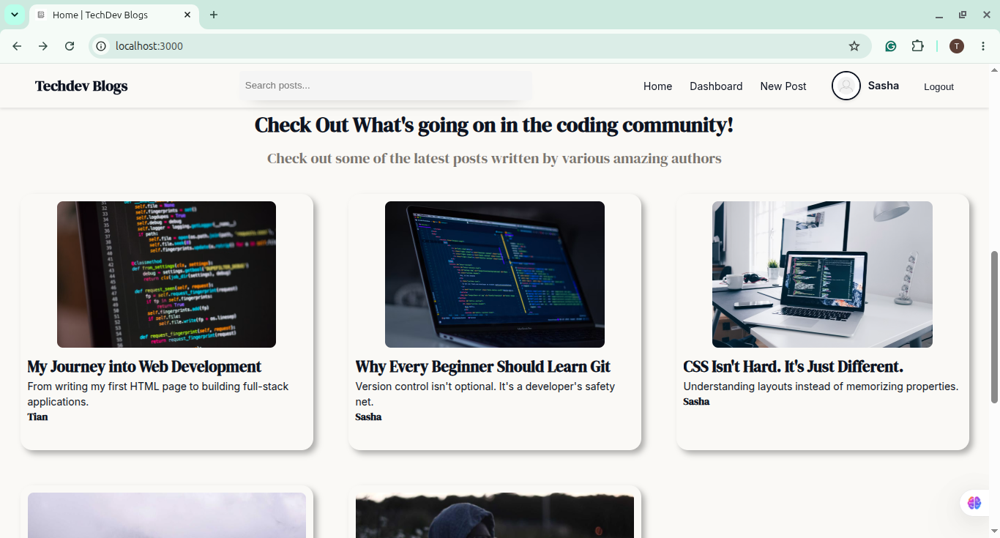
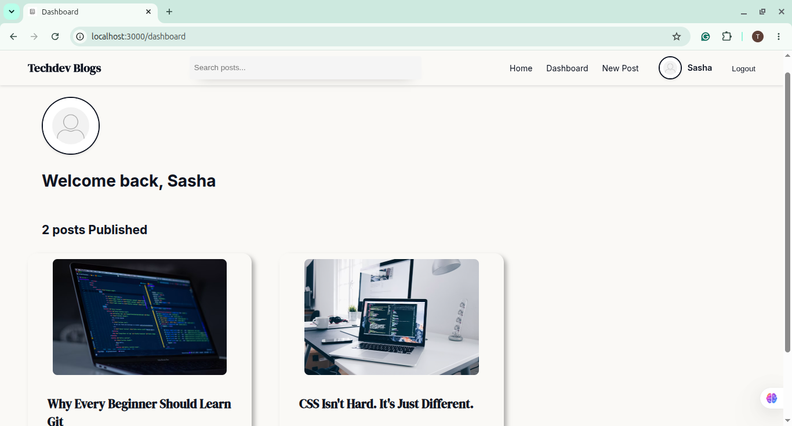
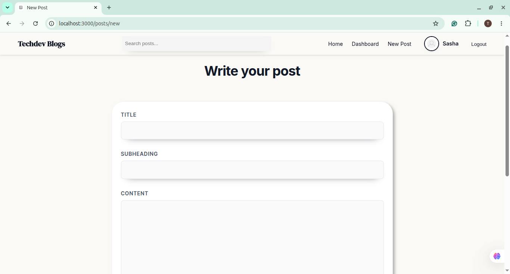
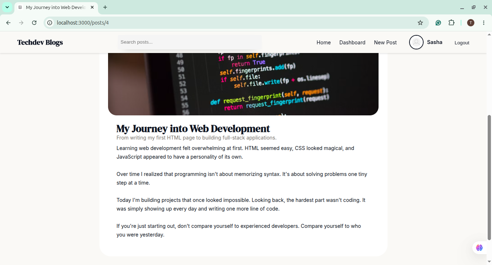

# TechDev Blogs
A full-stack blogging platform where developers and tech enthusiasts can share their ideas, publish articles, and explore posts written by other members of the community.

Built as a personal learning project, TechDev Blogs focuses on secure authentication, clean project architecture, and complete CRUD functionality using Node.js, Express, PostgreSQL, and EJS.

## Features
- User registration and login
- Secure password hashing using bcrypt
- Authentication with Passport.js
- Session-based authentication
- Create new blog posts
- Read posts from all users
- Edit your own posts
- Delete your own posts
- User dashboard displaying personal posts
- Responsive and clean user interface
- MVC project architecture
- PostgreSQL database integration

## Tech Stack

### Frontend
- HTML5
- CSS3
- EJS Templates
### Backend
- Node.js
- Express.js
### Database
- PostgreSQL
- pg (Connection Pool)
### Authentication
- Passport.js
- express-session
- bcrypt

## Project Structure
```text
.
├── config
│   ├── db.js
│   ├── multer.js
│   └── passport.js
├── controllers
│   ├── authController.js
│   └── blogController.js
├── index.js
├── middleware
│   ├── auth.js
│   └── locals.js
├── package.json
├── package-lock.json
├── public
│   ├── css
│   │   ├── base.css
│   │   ├── component.css
│   │   ├── form.css
│   │   ├── layout.css
│   │   └── pages
│   │       ├── home.css
│   │       ├── post-new.css
|   |       ├── post-show.css
│   │       └── Screenshots
│   ├── images
│   │   ├── default-avatar.jpeg
│   │   ├── index-hero-background.jpg
│   │   └── logo.jpeg
│   └── uploads
├── README.md
├── routes
│   ├── authRoutes.js
│   └── blogRoutes.js
└── views
    ├── dashboard.ejs
    ├── index.ejs
    ├── login.ejs
    ├── partials
    │   ├── footer.ejs
    │   ├── header.ejs
    │   ├── navbar.ejs
    │   ├── post-card.ejs
    │   └── post-form.ejs
    ├── post-edit.ejs
    ├── post-new.ejs
    ├── post-show.ejs
    ├── profile.ejs
    └── register.ejs
```

## Installation

Clone the repository: [git clone https://github.com/tubacodes/TechDev Blogs.git](https://github.com/tubacodes/TechDev-Blogs.git)

Navigate into the project: cd techdev-blogs

Install dependencies: npm install

Create a .env file and add the required environment variables.

Start the application: npm start

Visit: http://localhost:3000

## Environment Variables
Create a .env file in the root directory.

- PORT=3000

- DB_HOST=
- DB_PORT=
- DB_USER=
- DB_PASSWORD=
- DB_DATABASE=

SECRET=

## Screenshots
### Home Page



### Dashboard



### Create Post



### View Post


## What I Learned

Building this project helped me gain practical experience with:

- MVC architecture
- RESTful routing
- PostgreSQL database design
- SQL joins
- Connection pooling using pg.Pool
- Authentication using Passport.js
- Session management
- Password hashing with bcrypt
- CRUD operations
- Express middleware
- Modular project structure
- Organizing CSS into reusable components
- Deploying full-stack applications

## Live Demo

 [Live Website link](https://techdev-blogs.onrender.com)